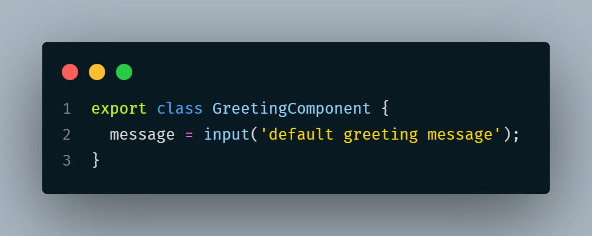
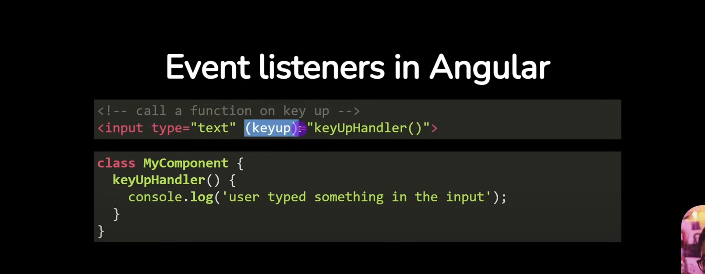
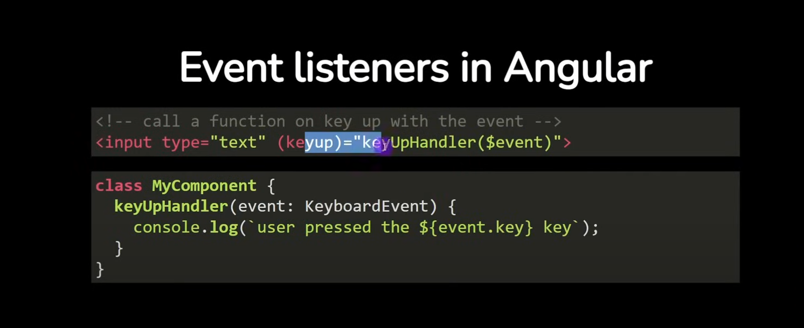

## Angular Component

root folder is -> app
### it has 
- AppComponent class and 
- decorator (@Component) which help to enhance the component with more details like
  - selector
  - templateUrl
  - styleUrl
  - imports
- whenever you style a component its stays within the component . it won't leak the style

## Creating the component 
`ng generate component componentName` or `ng g c componentName`

### In a nested directory
`ng g c componentFolderName/componentName`

## Data Binding
Binding data between the typescript class of the component and the component's template
### Using Signal
`Signal is a reactive primitive introduced in Angular 16 that provides a new way to manage state and reactivity within your application.`
- Creation
  - title = signal("hi hello");
- Usage
  - {{ title() }}

### without signal (traditional way)
- Creation
  - title = "hi hello";
- Usage
  - {{ title }}

## Passing data from Parent component to Child Component
 for that , child component need to accept the input from the parent component
 
 

 ## handling events
 
 

## Routing
- Angular is a single page application, using routes, you can still define different pages  - - that the user can navigate to.
The Browser only loads the bundles related to the user have accessed (like only it loads home page)
- it improve the performance of application and user experience

## Angular Services
- Angular Services are used to encapsulate data, making api calls, or performing task, that is not related directly related to data rendering
### creating angular services
`ng generate service services/serviceName`

In Service 
 - Injectable Decorator (service can be injected in other places)
 - ServiceClass (like TodoService class)

## Usage in Component
- we can create services and inject into any component 
- 

## Angular Build In control flow
`@for , @if etc`

## Making HTTP Call using Angular Services
- provide http module/providers in the app config using `provideHttpClient()` (app.config.ts)
- inject HttpClient Service
- use the http methods

## Angular Directives
Angular Directive allow you to add additional behavior to elements in our angular application
### Types of Angular Directives
- Components
- Attribute Directive
- Structural Directive (add elements to the dom based on the condition)

### create the directive in cli
`ng g directive directives/highlight-complete-todo`

- In-build directive `NgIf`
- study `effect`, `ElementRef`(services)

## Angular Pipes
Angular pipes are used to transform data right in the template
- There are so many in build pipes are there -> explore in angular web
- eg ;- UppercasePipe

### Custom Pipes
  - we are gonna create custom pipe to filter the todos